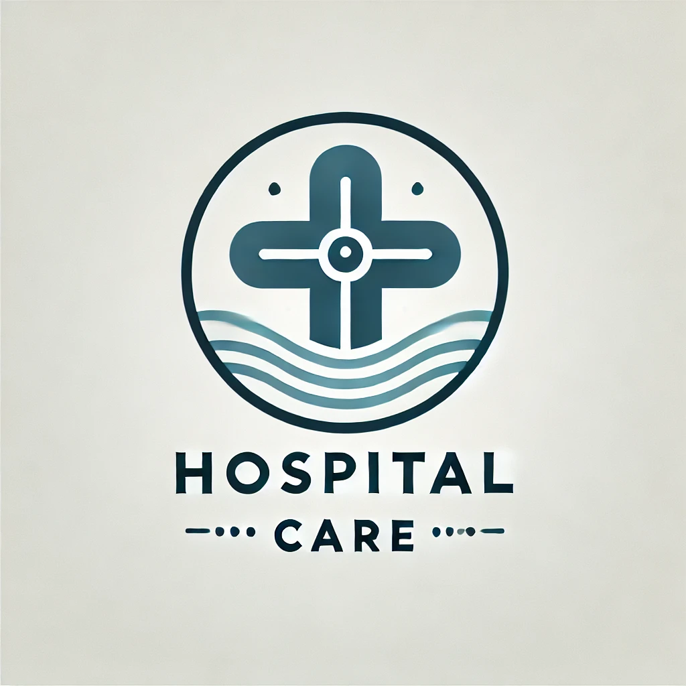

# **Hospital Care**

El proposito del proyecto es generar una página web responsiva para el Hospital Care, ya que actualmente no cuentan con una página web que les permita presentar a sus pacientes los servicios que ofrece y obtener información de ellos en base a testimonios de los mismos paciente que se atienden en el hospital.

Dentro de sus principales características se encuentra:

1. La presentación del logo del hospital que lo identifica.
2. Un menu de navegación para moverse a través de la página web y su contenido.
3. Un Botón para reservar citas médicas con los doctores disponibles.
4. Presentar nuestra misión, visión servicios y testimonios claves de los pacientes que se han atendido en Hospital Care.
5. Presentar al equipo de médicos que atienden en el hospital.
6. Un formulario de contacto, donde los paciente podrán realizar todas las preguntas que tengan.

# Algunas de las tecnologías que utilicé:


El proyecto se compone de una estructura simple:

1. Carpeta assets que contiene las imágenes, css y sass del proyecto.
2. Archivo .gitignore para controlar los elementos que suben a GitHub.
3. Página principal, contacto y equipo del proyecto web.

En cuanto a la forma de trabajar los estilos se utilizó la metodología BEM (Block, Element, Modifier). EN el cual para mantener el proyecto se utilización modularización de los elementos a través de SASS, lo cual permite una mejor mantenibilidad, orden y escalabilidad a futuro para modificaciones de la interfaz gráfica.

Ademas que se permite la utilización de variables e importación entre archivos, lo cual genera un ambiente de desarrollo ás intuitivo.

Se trabajo con una página responsiva a través de la utilización de media queries, para controlar los distintos puntos de ruptura de los dispositivos. Particularmente en el proyecto se utilizaron 1024px como primer punto de modificación para las tarjeta de la sección principal y luego 768px para la adpatación de los elementos del footer.

Sobre ls distribución que se utilizó de los elementos SASS, se partió creando una carpeta dentro de los ASSETS, la cual se dividió en componentes como header, footer, bienvenida, formulario de contacto, principal y testimonios, todos cumpliendo con el formato de escritura para modularizar en SASS. A parte se creó una carpeta con modulos generales como la base del proyecto y las variables. Finalmente un archivo general styles donde se importante los archivos modulares.


# Levantar el proyecto
Para poder trabajar en el proyecto debe abrir una linea de comando y seguir los siguientes pasos (la versión 1.1 de la página trabaja con html y css a través de SASS, por lo cual se recomienda instalar alguna extensión como live server):
```
cd UBICACION_A_TRABAJAR
```
```
git clone https://github.com/alangajardo/hospital.git
```
```
cd hospital
```
```
code .
```

## Autor
| [<br><sub>Alan Gajardo Medina</sub>](https://github.com/alangajardo) |
| :---: |